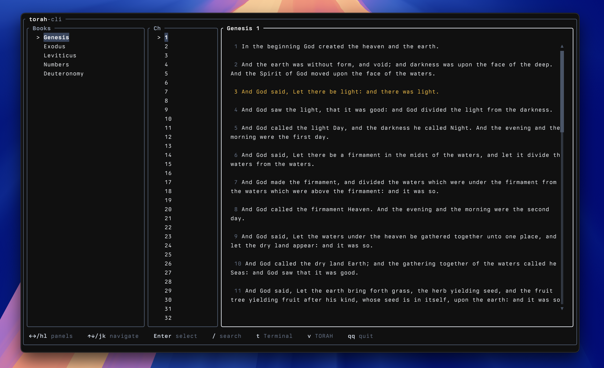

# torah-cli

A Torah TUI for terminal reading. Read the Five Books in your terminal.

Built with Rust. Single binary. Works fully offline with bundled data.



## Install

```sh
npm install -g @assafdori/torah-cli
```

Or with curl:

```sh
curl -fsSL https://raw.githubusercontent.com/assafdori/torah-cli/main/install.sh | sh
```

## Usage

Launch the interactive TUI browser:

```sh
torah
```

Read a specific verse:

```sh
torah read Genesis 1:1
```

Read a chapter:

```sh
torah read Exodus 3
```

Read a verse range:

```sh
torah read Deut 6:4-9
```

Search the Torah:

```sh
torah search "I am"
```

Random verse:

```sh
torah random
```

Verse of the day:

```sh
torah today
```

Replay the startup animation:

```sh
torah intro
```

## Interactive TUI

When you run `torah` with no arguments, it launches a full-screen terminal browser:

- **Left/Right arrows** - switch between panels (Books, Chapters, Torah)
- **Up/Down arrows** - navigate within a panel
- **Enter** - select a book or chapter
- **/** - live search the Torah
- **t** - cycle themes
- **qq** - quit (press q twice)

Your reading position and theme are saved automatically.

## Features

- Full-screen TUI with 3-panel browser (Books | Chapters | Torah)
- Animated startup banner
- Live search with instant results as you type
- Offline bundled Torah data (5 books, no internet required)
- Forgiving reference parser (`gen1:1`, `deut 6:4-9`, `bamidbar 6`)
- Pipe-friendly output
- Session persistence

## License

MIT
